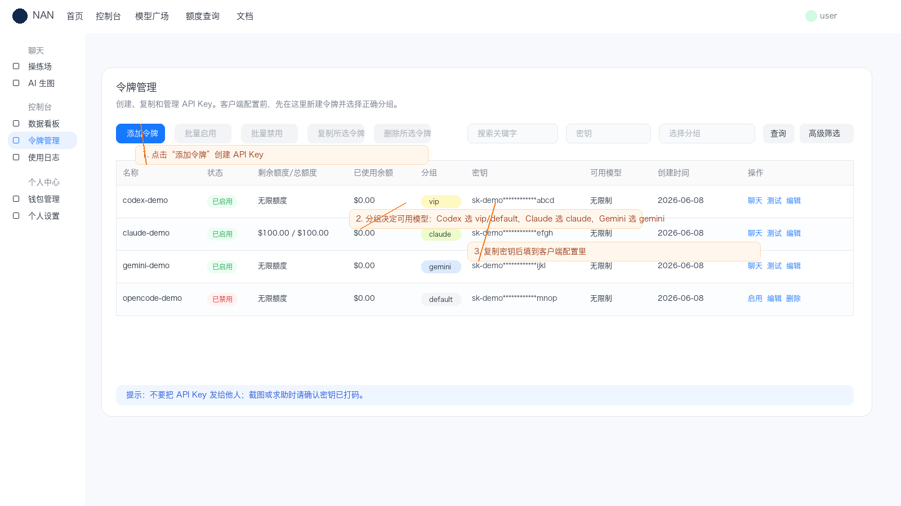

# NAN 客户端接入总览

> 本页只做选择和速查；每个工具的完整步骤已经拆到独立页面。飞书教程正文已迁移到对应页面。

## 1. 我该选哪个

| 目标                             | 推荐页面                                                 | 分组           | Base URL                     |
| -------------------------------- | -------------------------------------------------------- | -------------- | ---------------------------- |
| 终端里用 Codex 写代码            | [Codex](./NAN_CLIENT_CODEX.md)                           | `vip` / `svip` | `https://cn.meta-api.vip/v1` |
| Claude Code 调 Claude 模型       | [Claude Code](./NAN_CLIENT_CLAUDE_CODE.md)               | `claude`       | `https://cn.meta-api.vip`    |
| Claude Code 调 OpenAI/Codex 模型 | [Claude Code OpenAI](./NAN_CLIENT_CLAUDE_CODE_OPENAI.md) | 非 `claude`    | `https://cn.meta-api.vip`    |
| Gemini CLI                       | [Gemini](./NAN_CLIENT_GEMINI.md)                         | `gemini`       | `https://cn.meta-api.vip`    |
| OpenCode                         | [OpenCode](./NAN_CLIENT_OPENCODE.md)                     | `vip` / `svip` | `https://cn.meta-api.vip/v1` |
| WebChat / 本地网关               | [OpenClaw](./NAN_CLIENT_OPENCLAW.md)                     | 按模型选择     | OpenAI 带 `/v1`，Claude 不带 |
| 一键导入配置                     | [CC Switch 和聊天入口](./NAN_CLIENT_CCSWITCH.md)         | 按工具选择     | 平台自动生成                 |
| AI 生图                          | [AI 生图](./NAN_IMAGE_GENERATION.md)                     | 按图像模型选择 | 平台、技能包或 API           |
| 程序直接调用                     | [模型请求样例](./NAN_API_EXAMPLES.md)                    | 按模型选择     | 按协议选择                   |

## 2. 最容易填错的地方

| 错误                            | 正确做法                        |
| ------------------------------- | ------------------------------- |
| Codex Base URL 没带 `/v1`       | 填 `https://cn.meta-api.vip/v1` |
| Claude Code Base URL 带了 `/v1` | 填 `https://cn.meta-api.vip`    |
| Claude 模型没选 `claude` 分组   | 令牌分组选 `claude`             |
| Gemini 模型没选 `gemini` 分组   | 令牌分组选 `gemini`             |
| OpenAI/Codex 模型选了 `claude`  | 改成 `vip` / `svip` 等可用分组  |
| 环境变量改了不生效              | 重新打开终端、VSCode、IDE       |

## 3. 通用准备

所有客户端都先做这 4 步：

1. 登录 `https://cn.meta-api.vip/`。
2. 进入 `令牌管理` 创建令牌。
3. 按模型选择正确分组。
4. 复制完整 API Key。

模型以 `https://cn.meta-api.vip/pricing` 展示为准，不同分组可用模型不同。



图里重点看三处：

- `添加令牌`：创建新的 API Key。
- `分组`：决定这个令牌能调用哪些模型。
- `密钥`：复制后填到 Codex、Claude Code、Gemini、OpenCode 等客户端里。

## 4. 分组速查

| 客户端 / 模型         | 推荐分组               |
| --------------------- | ---------------------- |
| Codex / OpenAI 模型   | `vip` / `svip`         |
| Claude Code 调 Claude | `claude`               |
| Claude Code 调 OpenAI | 非 `claude`            |
| Gemini CLI            | `gemini`               |
| OpenCode              | `vip` / `svip`         |
| OpenClaw              | 按实际模型选择对应分组 |

## 5. 通用环境

多数 CLI 依赖 Node.js：

```bash
node --version
npm --version
```

没有 Node.js 时，去 `https://nodejs.org/` 下载 LTS 版本。

## 6. 独立教程

- [Codex 配置教程](./NAN_CLIENT_CODEX.md)
- [Claude Code 使用 Claude 模型](./NAN_CLIENT_CLAUDE_CODE.md)
- [Claude Code 使用 OpenAI/Codex 模型](./NAN_CLIENT_CLAUDE_CODE_OPENAI.md)
- [Gemini CLI 配置教程](./NAN_CLIENT_GEMINI.md)
- [OpenCode 配置教程](./NAN_CLIENT_OPENCODE.md)
- [OpenClaw 配置教程](./NAN_CLIENT_OPENCLAW.md)
- [CC Switch 与聊天入口配置](./NAN_CLIENT_CCSWITCH.md)
- [AI 生图：平台、技能包与 API](./NAN_IMAGE_GENERATION.md)
- [各厂商模型请求样例](./NAN_API_EXAMPLES.md)

## 7. 原始飞书链接备查

正文已经迁移，下面只用于核对历史版本：

| 工具                | 原始链接                                                        |
| ------------------- | --------------------------------------------------------------- |
| OpenClaw            | https://scn6x5davqvt.feishu.cn/docx/CFD4d4qJSou0aKxOhvHcJnkFngf |
| Codex               | https://my.feishu.cn/docx/GBH7dEbn1oQl0rxXosBcSd4Knie           |
| Claude Code         | https://scn6x5davqvt.feishu.cn/docx/QdNfdgLFloH0uyxyPbKcoK7Gn2e |
| Claude Code(OpenAI) | https://scn6x5davqvt.feishu.cn/docx/X2RPdxmRcojHuGxDDeRc0j9mn2f |
| Gemini              | https://scn6x5davqvt.feishu.cn/docx/HBFTdIsn6oGF7hxqAYEcQxnDnRh |
| OpenCode            | https://scn6x5davqvt.feishu.cn/docx/X9FRdtnkuoh0qMxzsdTcRAeRn6g |
